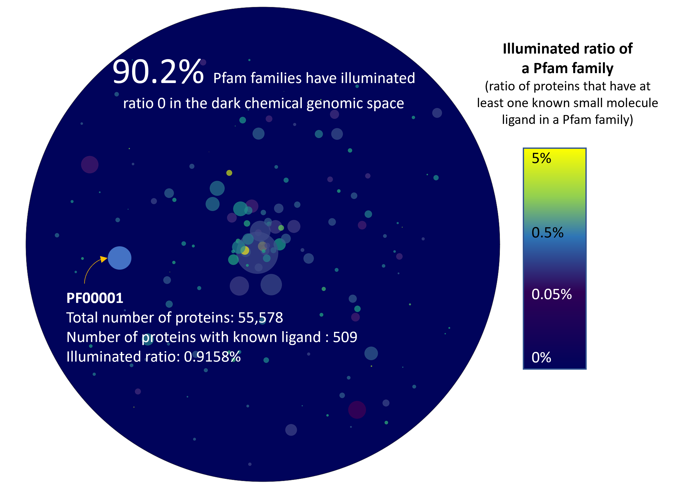

# PortalCG: Structure-enhanced Deep Meta-learning Predicts Billions of Uncharted Chemical-Protein Interactions on a Genome-scale

Shield: [![CC BY-NC 4.0][cc-by-nc-shield]][cc-by-nc]

This work is licensed under a
[Creative Commons Attribution-NonCommercial 4.0 International License][cc-by-nc].

[![CC BY-NC 4.0][cc-by-nc-image]][cc-by-nc]

[cc-by-nc]: http://creativecommons.org/licenses/by-nc/4.0/
[cc-by-nc-image]: https://licensebuttons.net/l/by-nc/4.0/88x31.png
[cc-by-nc-shield]: https://img.shields.io/badge/License-CC%20BY--NC%204.0-lightgrey.svg

This repository provides script to replicate experiments in PortalCG paper

# Environment setup
Necessary packages to be installed have been specified in <code>environment_setup.txt</code>. Docker file can also be found in the folder<code>environment/</code>

# Data
You can download data and pretrained weights from [here](https://zenodo.org/record/6950921)
# PortalCG
NatureCS under reivew. For Code Ocean replication

__NOTE__: PortalCG has three steps with twice transfer learning. Three large databases are used, Pfam, PDB, ChEMBL, all fairly large. *A full replication from scratch will take a month on a single GPU*. Here, we provide demo with trained weights at final step as well as instructions to replicate from scratch in each step.

## Environment setup 
- If running in Code Ocean, the environment will be set up automatically.
- If running locally for replication from scratch, pls follow <code>environment setup.txt</code>

## PortalCG training
PortalCG has two major components, (a) STL and (b) OOC-ML with 3 steps in total. Pls run the 3 steps in order.

####  Step1, first transfer learning | (a) STL, step-wise transfer learning
The first step is built on a published work, DISAE (published on JCIM), with replication instructions. In this step, a protein language model will be trained on Pfam with MSA-distilled triplets representation. The whole pfam knowlege will be tranfered to step2.

#### Step2, second transfer learning | (a) STL, step-wise transfer learning 
The second step will train on PDB dataset to predict binding site residue-atom contact map with protein descriptor pretrained in step1 and to be further tuned in this step. 
- To run from scratch: <code>python train_DTI_distance.py --batch_size=128 --eval_at=200 --global_step=40000</code>

 
#### Step3, final DTI prediction | (b) OOC-ML, out-of-cluster meta learning
In this final stage, there are 4 splits of data: OOD-train, iid-dev, OOD-dev,OOD-test. In this step, protein descriptor and chemical descriptor are pretrained in step2.

- To run for a short demo for only 20 steps with trained weights to check OOD-test AUC scores reported in __Table 2__: <code>python train_MAML_4split.py </code>
- To replicate __Figure 3(B)__ and __Figure S6__, pls run jupyter notebook: <code>exp_4split_logs/[PLOT]4 split.ipynb</code>
- To run from scratch: <code>python train_MAML_4split.py --fr_scratch=True --global_step=60000 --global_eval_step=80 </code>

## PortalCG prediction on DRD3 with wetlab validation 
- To verify the reported AUC scores on DRD3 with trained model: <code>python test_DRD.py</code>
